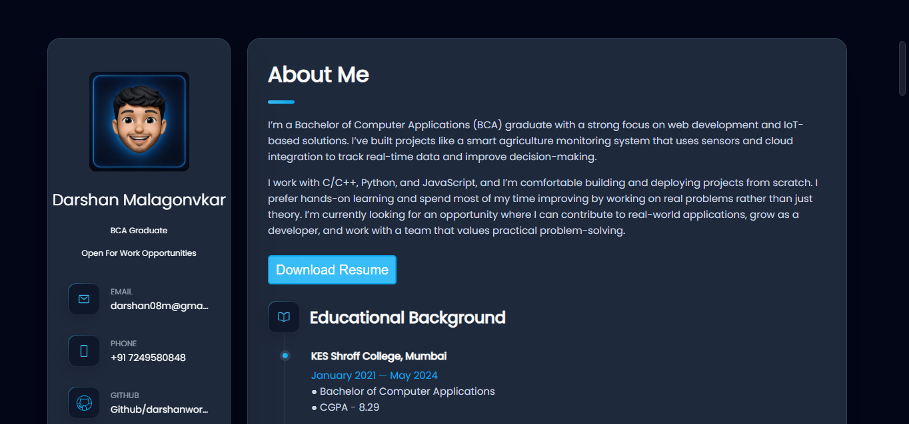
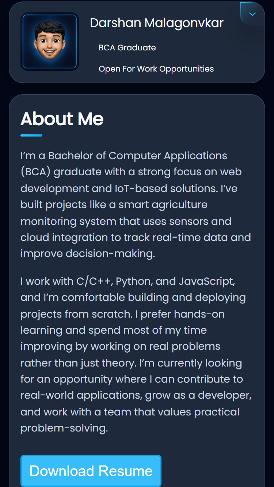

# Darshan Portfolio 🌐

A modern and responsive personal portfolio website showcasing my skills, projects, achievements, and professional journey in web development and software development.

This portfolio serves as a central hub for recruiters, developers, and visitors to explore my projects, technical skills, resume, and contact information.

---

## 🚀 Features

- Responsive design for desktop, tablet, and mobile devices
- Professional About Me section
- Skills and technologies showcase
- Project portfolio with GitHub repositories and live demos
- Resume download and view functionality
- Contact section with social media links
- Modern dark-themed UI with customized blue accents
- Smooth navigation and interactive user experience

---

## 🌐 Live Demo

```bash
https://your-portfolio-link.github.io/
```

---

## 📸 Desktop Preview



## 📱 Mobile Preview



---

## 🛠️ Technologies Used

- HTML5
- CSS3
- JavaScript (ES6)
- Ionicons
- Git & GitHub

---

## 📂 Project Structure

```bash
portfolio/
│
├── index.html
│
├── assets/
│   │
│   ├── css/
│   │   └── style.css
│   │
│   ├── js/
│   │   └── script.js
│   │
│   ├── images/
│   │   ├── avatar.png
│   │   ├── dashboard.jpg
│   │   ├── github.png
│   │   ├── savora-kitchen.png
│   │   ├── icon-dev.png
│   │   ├── linkedin.png
│   │   ├── smart-agriculture-project.jpg
│   │   └── text-to-voice-converter.jpg
│   │
│   └── resume/
│       └── Darshan_Resume.pdf
│
├── preview/
│   ├── desktop-preview.png
│   └── mobile-preview.png
│
├── README.md
├── LICENSE
├── CONTRIBUTING.md
└── .gitignore
```

---

## 💼 Featured Projects

### Smart Agriculture Monitoring System

- IoT-based environmental monitoring solution
- Real-time temperature, humidity, and soil moisture tracking
- Built using IoT devices and web technologies

### Restaurant Website

- Responsive restaurant landing page
- Modern UI design with menu showcase
- Built using HTML, CSS, JavaScript, and Bootstrap

### Text-to-Voice Converter

- Converts text into speech using browser speech synthesis
- User-friendly and responsive interface
- Built using HTML, CSS, JavaScript, and Web Speech API

---

## ⚙️ Installation

1. Clone the repository

```bash
git clone https://github.com/darshanworks/darshan-portfolio.git
```

2. Open the project folder

```bash
cd darshan-portfolio
```

3. Run the project

Simply open `index.html` in your browser.

---

## 📌 Future Improvements

- Add project filtering functionality
- Add blog section
- Improve contact form with backend integration
- Add dark/light mode switch
- Enhance project showcase animations

---

## 📫 Contact

- GitHub: https://github.com/darshanworks
- Email: darshan08m@gamil.com

---

## 👨‍💻 Author

Developed by Darshan Malgonvkar

---

## 📄 License

This project is licensed under the MIT License.
